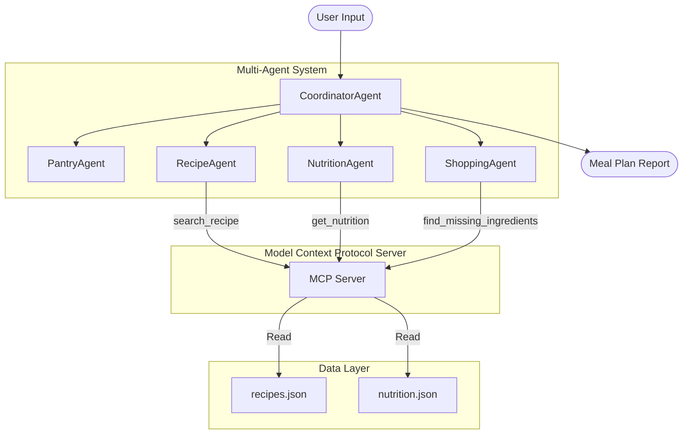

# LeftoversGPT

LeftoversGPT is an AI-assisted meal planning system designed to reduce food waste and optimize home cooking decisions. Built using the **Google Agent Development Kit (ADK)** and the **Model Context Protocol (MCP)**, it implements a modular, multi-agent architecture to process pantry ingredients, search recipes, retrieve nutrition facts, and calculate shopping list diffs.

---

## 🏗️ Architecture Overview

The system is designed as a local-first Python application consisting of:
1. **Multi-Agent Orchestration Layer** (`app/agent.py`): Orchestrated by `CoordinatorAgent`, delegating to four task-specific agents.
2. **MCP Tooling Layer** (`mcp_server/`): A local FastMCP server running via stdio transport to serve recipe matching, nutritional queries, and missing ingredients calculations.
3. **Data Layer** (`data/`): Offline storage using local JSON databases (`recipes.json` and `nutrition.json`).



---

## 📁 Project Structure

```
leftovers-gpt/
├── app/                        # ADK Agents and Application Code
│   ├── __init__.py             # Exposes app instance
│   ├── agent.py                # Defines the 5-agent multi-agent architecture
│   ├── fast_api_app.py         # FastAPI entry point for cloud/web-hosted runtime
│   ├── app_utils/              # Predefined telemetry and typing helpers
│   └── tools/                  # App tools package
│       ├── __init__.py
│       ├── mcp_client.py       # Helper to instantiate Local Stdio MCP tools
│       └── local_tools.py      # Hooks for any future non-MCP custom tools
├── mcp_server/                 # Model Context Protocol (MCP) Server
│   ├── __init__.py
│   ├── server.py               # FastMCP Server definition & tool registration
│   └── tools.py                # Empty tool implementations (search_recipe, get_nutrition, find_missing_ingredients)
├── data/                       # Offline JSON Databases
│   ├── recipes.json            # Mock database containing 20+ distinct recipes
│   └── nutrition.json          # Mock database containing 1:1 mapped nutritional data
├── tests/                      # Testing Suite
│   ├── eval/                   # Evaluation config and synthesized datasets
│   ├── integration/            # Integration tests
│   └── unit/                   # Unit tests
├── app.py                      # Main entry point for local execution & CLI testing
├── pyproject.toml              # UV / Hatch dependency configurations
├── GEMINI.md                   # Coding Agent Guide and requirements mappings
└── README.md                   # Project documentation
```

---

## 🛠️ Agents & MCP Tools Reference

### Multi-Agent Specifications

| Agent | Responsibility | Tools Used |
| :--- | :--- | :--- |
| **PantryAgent** | Normalizes and pre-processes raw user string input into a structured ingredient list. | None (Instruction only) |
| **RecipeAgent** | Suggests matching recipes based on ingredient overlap. | MCP: `search_recipe` |
| **NutritionAgent** | Retrieves calories, protein, fat, and carbs profiles for selected recipes. | MCP: `get_nutrition` |
| **ShoppingAgent** | Computes missing ingredients based on selected recipe requirement vs. pantry ingredients. | MCP: `find_missing_ingredients` |
| **CoordinatorAgent** | Coordinates the execution sequence across all sub-agents and aggregates final output. | Sub-agent Delegation |

### MCP Server Tools

1. **`search_recipe`**
   - **Input**: `ingredients: List[str]`
   - **Output**: Best matching recipe name, ingredients list, serving size, and a similarity score.
2. **`get_nutrition`**
   - **Input**: `recipe_name: str`
   - **Output**: Nutritional profile dict (serving_size, calories, protein, carbs, fat).
3. **`find_missing_ingredients`**
   - **Input**: `recipe_name: str`, `pantry_ingredients: List[str]`
   - **Output**: List of missing ingredients required for recipe completion.

---

## 🚀 Getting Started

### 1. Prerequisites
- **Python**: `>=3.11, <3.14`
- **uv**: Python package manager ([Install uv](https://docs.astral.sh/uv/getting-started/installation/))
- **google-agents-cli**: CLI tool for evaluation and scaffolding

```bash
# Setup CLI and install skills
uv tool install google-agents-cli
agents-cli setup
```

### 2. Install Project Dependencies
Run from the project root directory:
```bash
agents-cli install
```

### 3. Run the MCP Server Locally
You can test the MCP server standalone in standard I/O (stdio) transport:
```bash
uv run python mcp_server/server.py
```

### 4. Run the LeftoversGPT Agent (app.py)
Provide raw input ingredients to the local entry point to run the multi-agent workflow:
```bash
# Run with default ingredients
uv run python app.py

# Run with custom ingredients
uv run python app.py "chicken, broccoli, garlic"
```

### 5. Launch the ADK Web Playground
Interactive playground for manual conversation:
```bash
agents-cli playground
```
